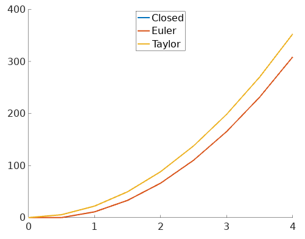
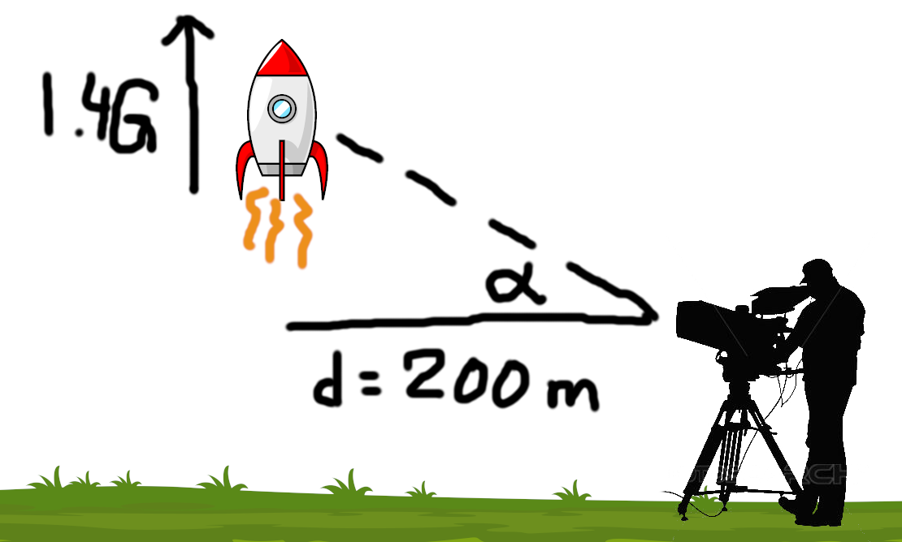
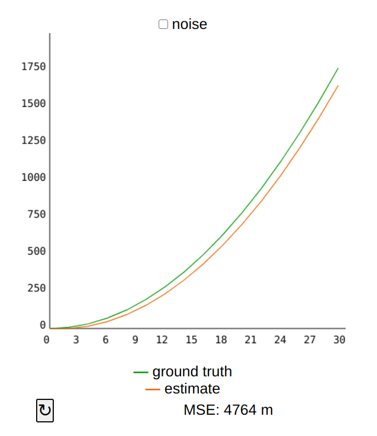
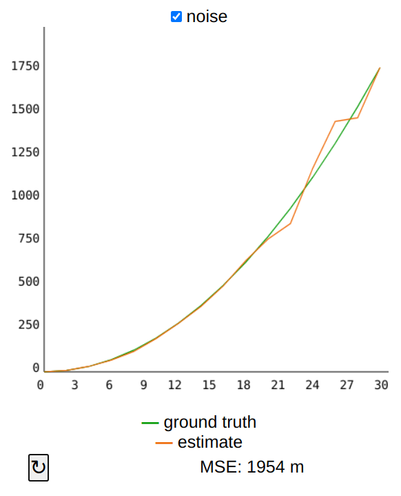
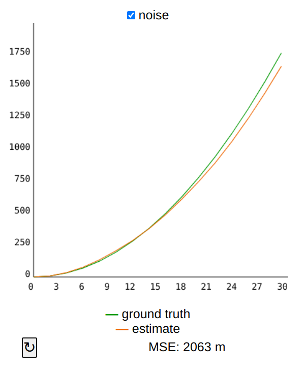

# Assignment 2: Extended Kalman Filter (EKF)
## Introduction
We lied to you in the [previous assignment](https://github.com/denniskb/hy475/tree/master/assign1_kalman). We used the Kalman filter for an obviously *non*-linear problem: a turning robot. The reason it still worked is two-fold:

- The robot behaved "linearly enough": It was driving at constant speed and didn't make any abrupt directional changes. The timestep was relatively small compared to its speed (30 ms vs 60 px/s). Thus our assumption of piecewise linear motion (move, turn, move, turn, ...) still allowed us to obtain an accurate estimate of the robot's location.
- The simulator itself was flawed relying on simple Euler integration to simulate the robot's ground truth path rather than using closed form/analytical solutions for its dynamics. Naturally, if your Kalman filter replicates the same equations as the simulator uses, you can obtain perfect tracking (in the absence of noise).

In this assignment we want to implement the EKF for a (correctly modelled) non-linear problem. Knowing its closed form/analytical solution we will be able to verify the EKF's superior performance. While the EKF in general does not guarantee optimilatiy anymore (in comparison, the standard Kalman filter guarantees to obtain the minimum possible MSE for *linear* problems), the mere fact that it more accurately models non-linear dynamics results in much better performance.

## Taylor Series
### Introduction
The [Taylor Series](https://en.wikipedia.org/wiki/Taylor_series) of a function *f* at point *a* approximates *f* in the vicinity of *a*. It is itself a **function**.


In the figure above you see approximations of *sin(x)* at *a=0* by Taylor series of various degrees. The higher the degree (the more terms it contains), the more accurate the approximation. The Taylor Series lies at the heart of the EKF. It is expressed as an (in)finite sum (depending on how many times *f* is differentiable) of *f*'s derivatives at the single point *a*:


### Example
[Modern dragsters](https://www.youtube.com/watch?v=rzlz7PAYV7Y) are so fast that they abandoned the quarter mile (~400 m) and are now competing in 1000 ft (~300m), which they complete in under 4 s at speeds north of 500 km/h. During those 4 s the drivers experience an *average* acceleration of **4.5 G**. Let us disregard complex effects such as wind resistance, tyre slip, ..., and assume that the cars accelerate at a *constant* 4.5 G. We can now model "distance traveled over time" using the well-known kinematics equation `s = 0.5 * a * t^2` which allows us to calculate the *s* with *infinite* accuracy. It should be equally simple for the reader to estimate *s* using Euler integration:

<details>
<summary>Expand to reveal solution</summary>

```matlab
s = s + v * dt;
v = v + 4.5G * dt;
```
</details>

If we plot both the closed form and the Euler integration on [0 s, 4 s] with a *dt* of 0.5 s, we obtain the following:


The Euler method (with its "piecewise-linear" assumption) greatly underestimates *s*. **Try and *expand* the Euler method with terms from the Taylor series (hence "Taylor expansion") in order to obtain a more accurate estimate of *s***.

<details>
<summary>Expand to reveal solution</summary>
The function in question is the kinematic equation `f(t) = 0.5 * a * t^2` which is twice differentiable:

```
f'(t)  = a * t
f''(t) = a
```

Hence its Taylor series at point *p* is given by

```
T(x) = 0.5 * a * t^2  +  a * t * (x-p)  +  a/2 * (x-p)^2
```

Thus the Taylor expansion of the Euler method becomes:

```matlab
s = s + v * dt + 2.25G * dt^2;
v = v + 4.5G * dt;
```
</details>



The estimate provided by the Taylor expansion coincides perfectly with the closed form (their MSE is in the order of 1e-28) in spite of the very coarse time step of 0.5 s. In order to obtain a similarly accurate result using the Euler method we would have to choose a ridiculously low time step *dt*:

|  dt   | MSE (m) |
| ----- | ------: |
| 0.5s  |  689.79 |
| 0.1s  |   26.25 |
| 0.01s |    0.26 |

### Summary
The Taylor expansion allows us to estimate the dynamics of a (non-linear) system...

- *incrementally* which is very well suited for robotics whose control software typically works in an iterative/clock-driven fashion.
- *numerically* without the need for deriving complex analytical solutions or employing (often computationally expensive) symbolic math libraries.
- *accurately* even for very coarse time steps. This allows us to pick our time resolution depending on our application and not be concerned with precision issues. Simpler methods, such as Euler integration, would require a prohibitively small (and thus slow) time step in order to produce reliable results.

**The connection with EKF** is very simple: EKF is mostly identical with the standard Kalman filter: It replaces the matrix products `A*mu + B*u` and `C*mu` with (non-linear) functions `g(u, mu)` and `h(mu)`. Finally, in order to calculate the Kalman gain, `A` and `C` are replaced with `G` and `H` which contain the (partial) Taylor expansions of `g` and `h` with respect to each of their parameters. Most literature only uses *first order* Taylor expansion (i.e. it aborts the Taylor expansion after the first term) which effectively turns `G` and `H` into Jacobians (a matrix of partial derivatives of a vector-valued function with respect to all its parameters).

## EKF
In this assignment we want to employ the EKF to track a launching rocket's altitude from camera footage.


We know the rocket's average acceleration (within some error) as well as the distance of the camera system from the launch pad and the camera's angle (within some error):



Head over to our [interactive plotting tool](https://denniskb.github.io/hy475/assign2) which you'll find pre-populated with an incorrect and incomplete EKF. Plotted is the rocket's altitude over time. Even in the absence of noise, our filter provides a very poor estimate:



The effect is even more amplified with noise turned on. This is because in its current form the filter uses Euler integration in order to advance the rocket's dynamics. Your homework is to rewrite the dynamics equations to use Taylor expansion and complete the EKF implementation. The template code is designed to follow [slide 31](https://www.csd.uoc.gr/~hy475/lectures/2.kalman.ppt) from your lectures as close as possible which it references heavily in comments.

### Tips (read carefully)
<details>
<summary>Display provided template</summary>

```javascript
if (typeof this.s === 'undefined') {
  // state (mu):
  this.s = 0; // altitude (m)
  this.v = 0; // velocity (m/s)

  this.S = math.zeros(2, 2);
}

// PREDICTION

// TODO: Use Taylor expansion for higher accuracy:
// g(mu)
function g1(s, v) { return s + v * dt; }
function g2(s, v) { return v + a * dt; }

// mu = g(mu)
this.s = g1(this.s, this.v);
this.v = g2(this.s, this.v);

/* TODO: Uncomment and implement EKF
var G = [
  [deriv. of g1 wrt. s, deriv. of g1 wrt. v],
  [deriv. of g2 wrt. s, deriv. of g2 wrt. v]
];
var GT = math.transpose(G);

var R = math.dotPow([
  [est. err. in s, 0],
  [0, est. err. in v]
], 2);

// S = G*S*GT + R
this.S = math.add(math.multiply(G, this.S, GT), R);

// CORRECTION

// h(mu)
function h(s, v) { ... }

var H = [
  deriv. of h wrt. s, deriv. of h wrt. v
];
var HT = math.transpose(H);

var Q = math.pow(obs. err. in z, 2);

// K = S*HT*(H*S*HT + Q)^-1
var K = math.multiply(
  this.S, HT, math.inv(math.add(math.multiply(H, this.S, HT), Q))
);

// mu = mu + K*(z - h(mu))
[this.s, this.v] = math.add(
  [this.s, this.v],
  math.multiply(K, z - h(this.s, this.v))
)._data;

// S = (I-K*H)*S
this.S = math.multiply(
  math.subtract(math.identity(2), math.multiply(K, H)), this.S
);
*/

return this.s;
```
</details>

- The main (and only) difference compared to your lecture slides is that, instead of storing our state in a vector `mu`, we reference its components `s` and `v` directly, which leads to simpler code. Similarly, instead of storing a vector of state transition functions `g`, we reference the individual functions `g1` and `g2` directly.
- You'll need to complete all **TODO**s and **...**, in order:
    1. Refactor the state transition function `g1` to use Taylor expansion in place of Euler integration (making it non-linear), similarly to the dragster example. If you do this correctly, your MSE should drop to 0 (with noise turned off).
    2. Uncomment the EKF-part, don't forget to remove the `*/` in the second-to-last line as well.
    3. Fill in the Jacobian matrix `G` ("deriv." = derivative, "wrt." = with respect to).
    4. Fill in the estimation error matrix `R`. The rocket's accelerometer (whose data is provided in the function parameter `a`) has an error STD of 0.1 G. In contrast to the first assignment there is no need to convert the errors in `R` and `Q` to a common unit. (This is handled automatically by the EKF via the matrix `H` which contains partial derivatives of `h`. `h(mu)` converts `mu` from meters to radians after which the multiplication with `K` (which has the inverse of `H` as one of its products) converts it back into meters. Matrix `C` from the standard Kalman filter merely formatted/re-arranged `mu` but did not perform any conversions.)
    5. Implement the (non-linear) function `h` whose job it is to relate our state `mu=[s, v]` to the measurement `z` (the camera angle, called "alpha" in the diagram above).
    6. Fill in the Jacobian matrix `H`. You will need to use the [chain rule](https://en.wikipedia.org/wiki/Chain_rule) for this.
    7. Calculate the observation error and store it in `Q`. The camera reports its angle with an error STD of 0.02 rad.
- In addition to your lecture material, the built-in debugger, the `console.log()` function and ofc. the issue tracker, you can use the following sanity checks to judge whether you're on the right track:
    - With the noise turned off, your EKF implementation should still produce a MSE of ~0.
    - *Turn on the noise*.
    - Set `Q` to 0, so that the EKF bases its answer on the measurement `z` alone. You should obtain a MSE of ~2000 and your plot should look similar to fig. **X**.
    - Set `Q` to 1000, so that the EKF bases its answer solely on the motion estimate. Once again your MSE should be ~2000 and your plot should look similar to fig. **Y**.
    - Set `Q` back to its proper value (the one you calculated as part of your homework). You should obtain a MSE of ~400 and our plot should look similar to fig. **Z**.


*Fig. X: noise on, Q=0*


*Fig. Y: noise on, Q=1000*


*Fig. Z: noise on, proper Q*